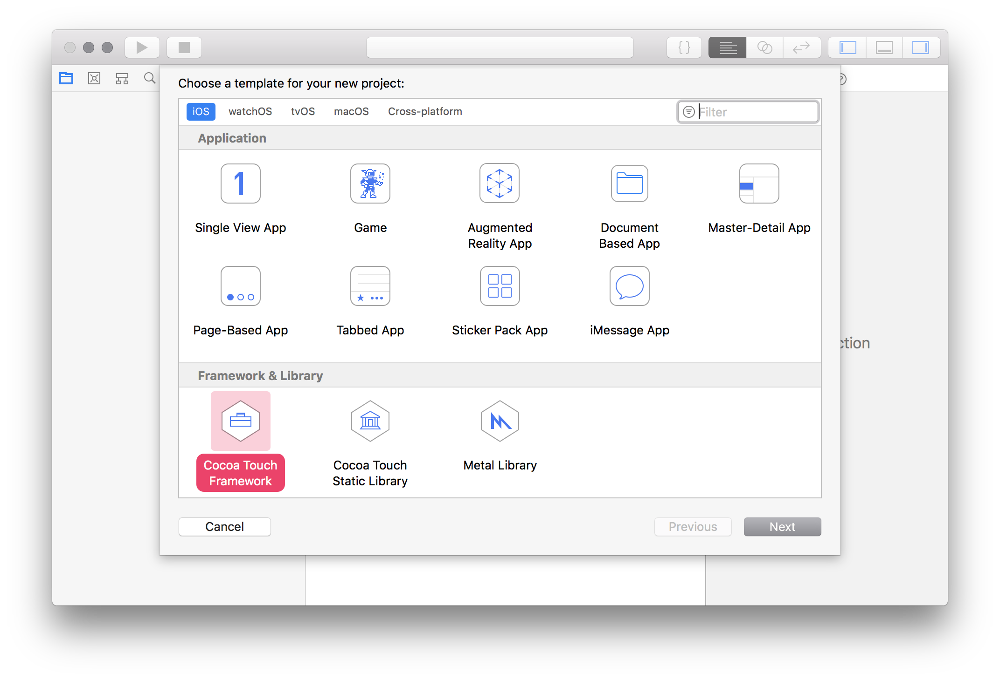

### Workshop #1

# HelloSwift

### Opis zadania

Celem zadania jest stworzenie dwóch klas wykonujących proste funkcje. Dzięki temu zadaniu poznasz lepiej składnię Swifta, oraz nauczysz się tworzyć proste klasy typu *Util*. Nauczysz się też podstaw obsługi *XCode*, oraz procesu uruchamiania testów jednostkowych.

Pierwszą klasą jest klasa `MathTool`. Klasa ta posiada jedną metodę, której zadaniem jest policzenie wartości ciągu Fibonacciego dla podanego argumentu. Przykładowe wywołania dla tego klasy mają wyglądać w ten sposób:

```swift
let math = MathTools()
print(math.fibonacci(10))
// prints: 55
```

---

Drugą klasą jest klasa `StringTools`. W tej klasie stworzymy jedną funkcję, która liczy ilość wystąpień podanego znaku w przekazanym `String`u. Przykładowe użycie mamy poniżej:

```swift
let stringTools = StringTools()
let count = stringTools.countOccurences(character: "i", from: "Hello. My name is Michał.")
print(count)
// prints: 2
```

Klasa `StringTools` obsługuje dwie wersje podanej funkcji. Może zliczać wystąpienia zarówno z uwzględnieniem wielkości znaków, jak i w trybie case-insensitive. Parametr `caseSensitive` jest ostatnim parametrem funkcji, który **domyślnie** ma wartość `true`. Poniżej przykładowe wywołanie z użyciem parametru.

```swift
print(StringTools().countOccurences(character: "h", from: "Hello. My name is Michał.", caseSensitive: true))
// prints: 1

print(StringTools().countOccurences(character: "h", from: "Hello. My name is Michał.", caseSensitive: false))
// prints: 2
```

### Wskazówki

1. Po pierwsze stwórz pusty projekt w XCode. Wybierz template **iOS -> Cocoa Touch Framework**. Zanzacz, że **chcesz** stworzyć testy jednostkowe.

2. Stwórz dwa pliki pod odpowiednie klasy (*StringTools.swift* oraz *MathTools.swift*).
3. Napisz nagłówki funkcji. Przeczytaj odpowiednie informacje o [domyślnych parametrach funkcji](https://docs.swift.org/swift-book/LanguageGuide/Functions.html#ID169).
4. Target który wybrałeś to *biblioteka*. Dlatego nie możesz jej **uruchomić** – możesz jedynie uruchomić testy jednostkowe. Zrób to przy pomocy skrótu klawiaturowego **⌘+U**.
5. Testy jednostkowe, które stworzyłem do zadania pobierz i umieść w projekcie tak, aby móc sprawdzać czy Twoje zadanie się uruchamia i spełnia założenia.
  - [MathToolsTests.swift](assets/MathToolsTests.swift)
  - [StringToolsTests.swift](assets/StringToolsTests.swift)
6. Jako rozwiązanie prześlij *cały projekt XCode*. Pamiętaj, żeby dodać do projektu odpowiedni plik [`.gitignore`](https://www.gitignore.io/api/swift,xcode,macos).

### Kryteria oceny

1. Poprawnie stworzony projekt typu Cocoa Touch Framework.
2. Przechodzące wszystkie testy.
3. Styl kodu.
4. Umieszczenie klas w osobnych, poprawnie nazwanych plikach.
5. Poprawnie stworzone repozytorium w projekcie, poprawnie stworzony commit kodu, dodany plik .gitignore.

### Odpowiedzi

Odpowiedź (cały, spakowany w .zip folder projektu) wyślij mailem na adres [email](mailto:ios@daftacademy.pl) do końca najbliższej soboty: **17.11.2018, 23:59**.

Przypominam, że jest możliwość wykonania zadania w salce na MiMUW. Termin to **środa w godzinach 16:00 - 18:00**. Przyjdźcie w tym terminie – administratorzy uruchomią Wam system i będziecie mogli wykonać zadanie.
