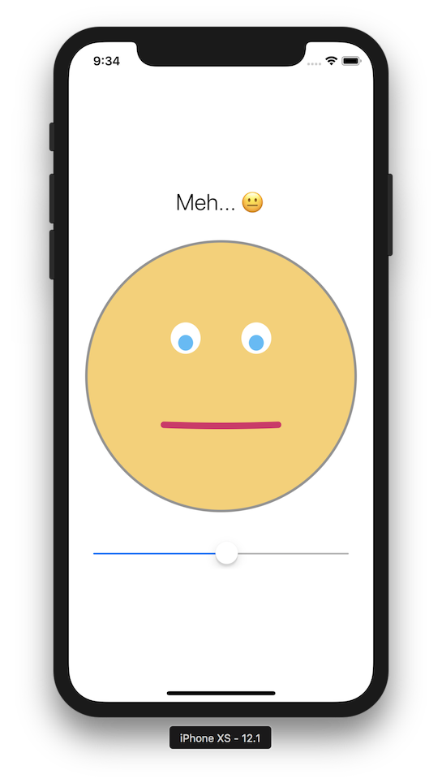

### Workshop #3

# Smile App

> Zaczynamy wchodzić na głębsze iOSowe wody: To zadanie może Wam zająć ~dużo~ trochę więcej czasu.

### Opis zadania

Celem zadania znowu jest swtorzenie jednoekranowej aplikacji **Smile**.

Na ekranie mają się znaleźć 3 elementy: `UILabel`, `SmileView`, oraz `UISlider`. Przeczytaj o [`UILabel`](https://developer.apple.com/documentation/uikit/uilabel) oraz [`UISlider`](https://developer.apple.com/documentation/uikit/uislider) w dokumentacji.

Główną funkcjonalnością aplikacji jest zmienianie poziomu uśmiechu w `SmileView` *oraz* tekstu znajdującego się w `UILabel` w oparciu o poziom przesunięcia `UISlider`'a. Poniżej screenshoty z gotowej aplikacji.




### Wskazówki

1. Zastanów się nad architekturą aplikacji. Co w niej będzie modelem? Co będzie widokiem? Jak reprezentować Twój *Model* w postaci obiektu / obiektów?
2. Stwórz pusty projekt w XCode. Użyj template'u *Single View App*. Otwórz plik Main.storyboard, i przeciągnij wszystkie potrzebne widoki do Twojego ViewControllera. Więcej informacji o edytorze Storyboard'ów znajdziesz [tutaj](http://help.apple.com/xcode/mac/current/#/dev31645f17f).
3. Po umieszczeniu wszystkich elementów na ekranie, dodaj odpowiednie constrainty, żeby pozycje elementów były poprawne. Więcej informacji o AutoLayoucie i dodawaniu Constraint'ów znajdziesz [tutaj](http://help.apple.com/xcode/mac/current/#/devc5759ad6f).
	- Tip 1: Zastanów się, jak opisałbyś layout językiem ludzkim. Spróbuj przełożyć to na constrainty.
	- Tip 2: Spróbuj uruchomić swoją aplikację na różnych symulatorach, oraz symulować obracanie ekranu. Sprawdź, czy Twoje widoki odpowiednio reagują na te zdarzenia.
	- Tip 3: Nie próbuj robić kilku rzeczy na raz. Zostaw na razie rysowanie uśmiechu, czy reagowanie na zmiany `UISlider`'a. Skup się tylko na poprawnym pozycjonowaniu elementów na ekranie. Aby widzieć `SmileView` bez żadnej zawartości, ustaw mu `backgroundColor`.
4. Kolejnym krokiem jest podpięcie odpowienich akcji i outletów w kodzie. Do tego potrzebujesz wykorzystać jedno **IBAction** (metoda z ViewControllera, która zostanie wykonana po zmianie wartości w `UISlider`), oraz dwa lub trzy **IBOutlet**y – referncja z `UIViewController`a do obiektu `UILabel` – w celu ustawienia tekstu, oraz do obiektu `SmileView` – w celu ustawienia na nim poziomu uśmiechu.
	- Tip 1: Przeczytaj dokładnie dokumentację o działaniu i podpinaniu IBOutlets oraz IBActions. Możesz je znaleźć odpowiednio [tutaj](http://help.apple.com/xcode/mac/current/#/devc06f7ee11) oraz [tutaj](http://help.apple.com/xcode/mac/current/#/dev9662c7670).
5. Połącz się z obiektem `SmileView` poprzez mechanizm [**dataSource / delegate**](https://developer.apple.com/library/content/documentation/General/Conceptual/CocoaEncyclopedia/DelegatesandDataSources/DelegatesandDataSources.html). Pamiętaj o **zarządzaniu pamięcią** i cyklach referencji!

### Jak Stworzyć `SmileView`?

Aby stworzyć `SmileView`, będziesz potrzebował kodu rysującego. Na iOSie robimy to poprzez stworzenie subclassy `UIView`. Twój kod będzie wyglądał mniej więcej tak:

```swift
protocol SmileDataSource: class {
  // some function that will get the current smile level from the data source (the View Controller)
}

class SmileView: UIView {
  // data source reference

  override func draw(_ rect: CGRect) {
    // ... custom drawing code
  }
}
```

Ponieważ stworzenie `SmileView` oraz `Core Graphics` nie jest przedmiotem tych zajęć, stworzyłem [plik](assets/SmileView.swift), który zawiera wszystko czego potrzebujecie do stworzenia `SmileView`.

### Kryteria oceny

1. Poprawnie stworzona aplikacja
2. Wydzielenie modelu do osobnej klasy
3. Stworzenie odpowiednich constraintów (poprawne wyświetlanie na różnych urządzeniach)
4. Spięcie `IBOutlet`s oraz `IBAction`s
5. Skorzystanie z patternu *Data Source*
6. Reagowanie i zmieiani

### Odpowiedzi

Odpowiedź (cały, spakowany w .zip folder projektu) wyślij mailem na adres [email](mailto:ios@daftacademy.pl) do końca najbliższej soboty: **01.12.2018, 23:59**.

Przypominam, że jest możliwość wykonania zadania w salce na MiMUW. Termin to **środa w godzinach 16:00 - 18:00**. Przyjdźcie w tym terminie – administratorzy uruchomią Wam system i będziecie mogli wykonać zadanie.
