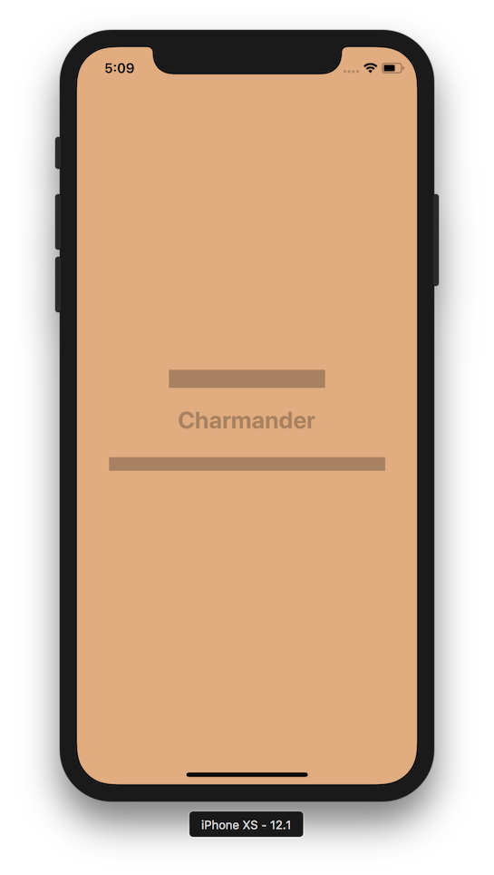
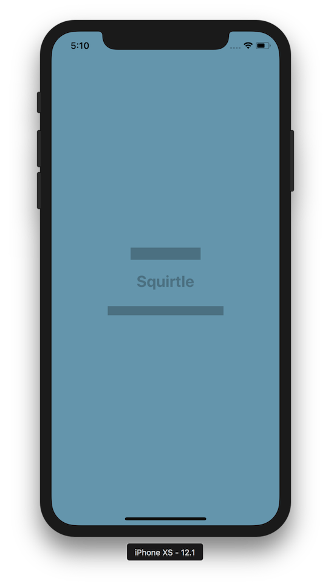
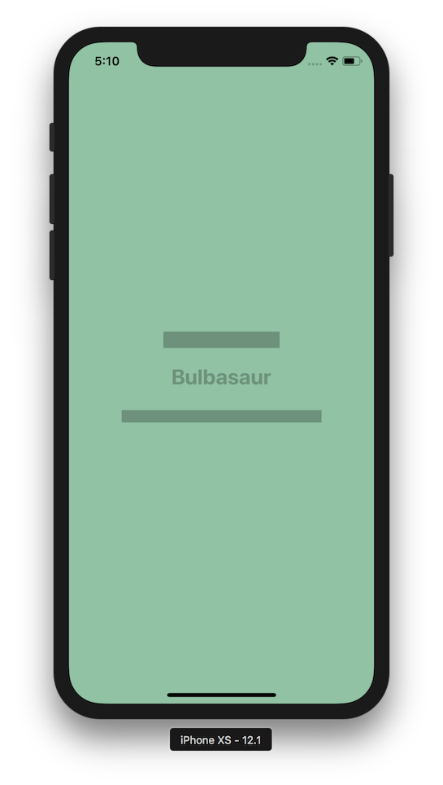
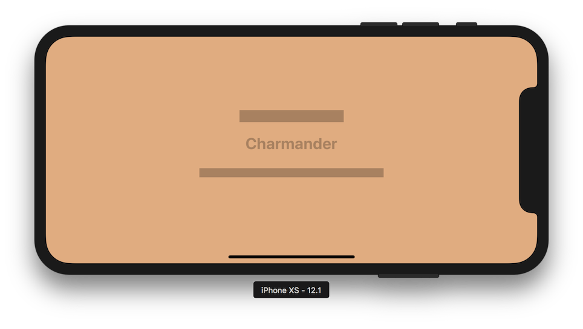

### Workshop #4

# Pokémon Toggle

### Opis zadania

Celem zadania jest swtorzenie jednoekranowej aplikacji **Pokémon Toggle**.

Na ekranie mają się znaleźć 3 elementy: `UILabel` oraz dwa `UIView`. Przeczytaj o [`UILabel`](https://developer.apple.com/documentation/uikit/uilabel).

Główną funkcjonalnością aplikacji jest zmienianie aktualnie wybranego Pokémona przy pomocy tapnięcia. Aplikacja mocno wykorzystuje Auto Layout. Będziesz również musiał zmieniać kolory aplikacji w zależności od akutalnie wybranego Pokémona.

1. `UILabel` ma być tej samej szerokości co tekt, który zawiera
2. `UIView` poniżej napisu ma być stałej wysokości **15 pt**, oddalony o **25 pt** od Labela (baseline).
3. Szerokość `UIView` poniżej napisu ma być **dwa razy większa** niż szerokość Labela.
4. `UIView` powyżej napisu ma być stałej wysokości **20 pt**, oddalony o **20 pt** od Labela.
5. Szerokość `UIView` powyżej napisu ma być **o 20 pt większa** niż szerokość Labela.

Poniżej screenshoty z gotowej aplikacji.

### Wskazówki

1. Zastanów się nad architekturą aplikacji. Co w niej będzie modelem? Co będzie widokiem? Jak reprezentować Twój *Model* w postaci obiektu / obiektów?
2. Stwórz pusty projekt w XCode. Użyj template'u *Single View App*. Otwórz plik Main.storyboard, i przeciągnij wszystkie potrzebne widoki do Twojego ViewControllera. Więcej informacji o edytorze Storyboard'ów znajdziesz [tutaj](http://help.apple.com/xcode/mac/current/#/dev31645f17f).
3. Po umieszczeniu wszystkich elementów na ekranie, dodaj odpowiednie constrainty, żeby pozycje elementów były poprawne. Więcej informacji o AutoLayoucie i dodawaniu Constraint'ów znajdziesz [tutaj](http://help.apple.com/xcode/mac/current/#/devc5759ad6f).
	- Tip 1: Zastanów się, jak opisałbyś layout językiem ludzkim. Spróbuj przełożyć to na constrainty.
	- Tip 2: Spróbuj uruchomić swoją aplikację na różnych symulatorach, oraz symulować obracanie ekranu. Sprawdź, czy Twoje widoki odpowiednio reagują na te zdarzenia.
4. Kolejnym krokiem jest podpięcie odpowienich outletów w kodzie. Zrób to analogicznie do poprzedniego zadania.
5. Kolor jest property Pokémona. Aby dostać ciemniejszy kolor, użyj funkcji `darkenColor()` (dostarczona w extension).
6. Aby obsłużyć Tap – użyj [`UITapGestureRecognizer`](https://developer.apple.com/documentation/uikit/uitapgesturerecognizer).
7. Klasy potrzebne do stworzenia odpowiednich struktur Pokémonów oraz koloru pobierz tutaj:
	- [Pokemon.swift](assets/Pokemon.swift)
	- [PokemonLoader.swift](assets/PokemonLoader.swift)
	- [UIColor+Extension.swift](assets/UIColor+Extension.swift)

### Kryteria oceny

1. Poprawnie stworzona aplikacja
2. Wydzielenie modelu do osobnej klasy
3. Stworzenie odpowiednich constraintów (poprawne wyświetlanie na różnych urządzeniach)
4. Spięcie `IBOutlet`s oraz `IBAction`s
5. Poprawna obsłga tapnięcia
6. Poprawne zmienianie kolorów
7. Zastosowanie MVC

### Odpowiedzi

Odpowiedź (cały, spakowany w .zip folder projektu) wyślij mailem na adres [email](mailto:ios@daftacademy.pl) do końca najbliższej soboty: **08.12.2018, 23:59**.

Przypominam, że jest możliwość wykonania zadania w salce na MiMUW. Termin to **środa w godzinach 16:00 - 18:00**. Przyjdźcie w tym terminie – administratorzy uruchomią Wam system i będziecie mogli wykonać zadanie.
