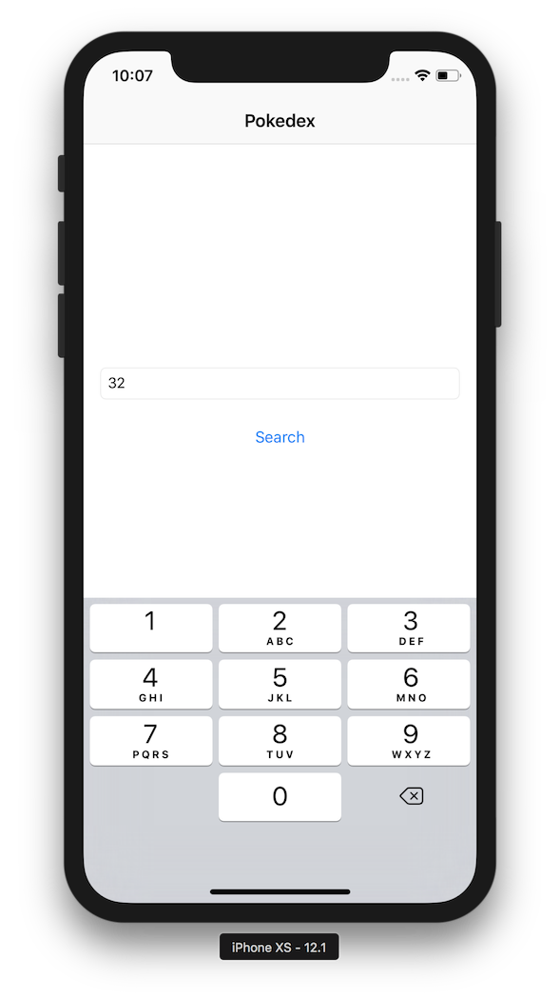
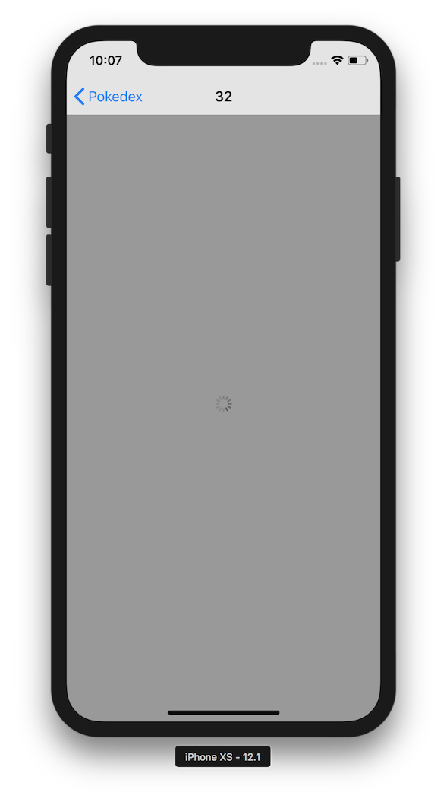
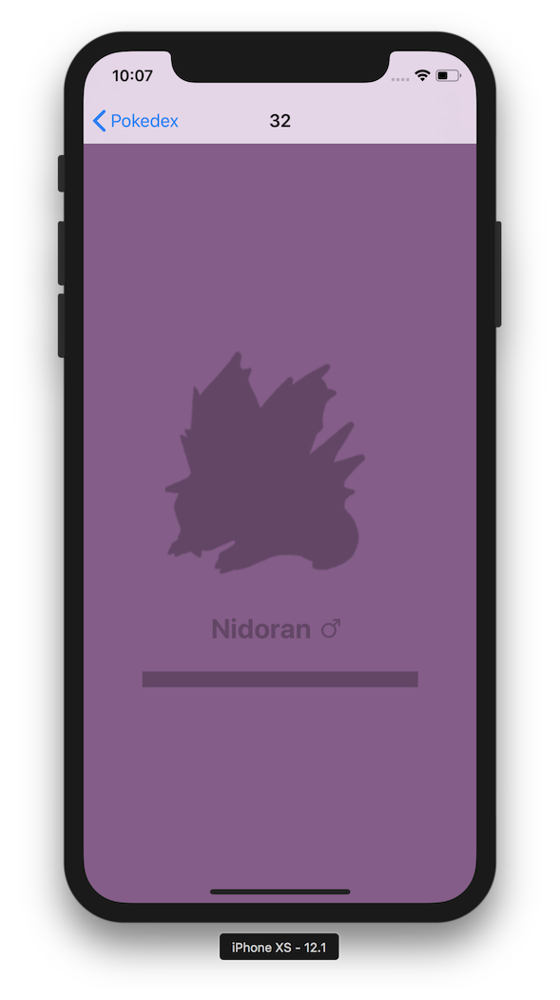
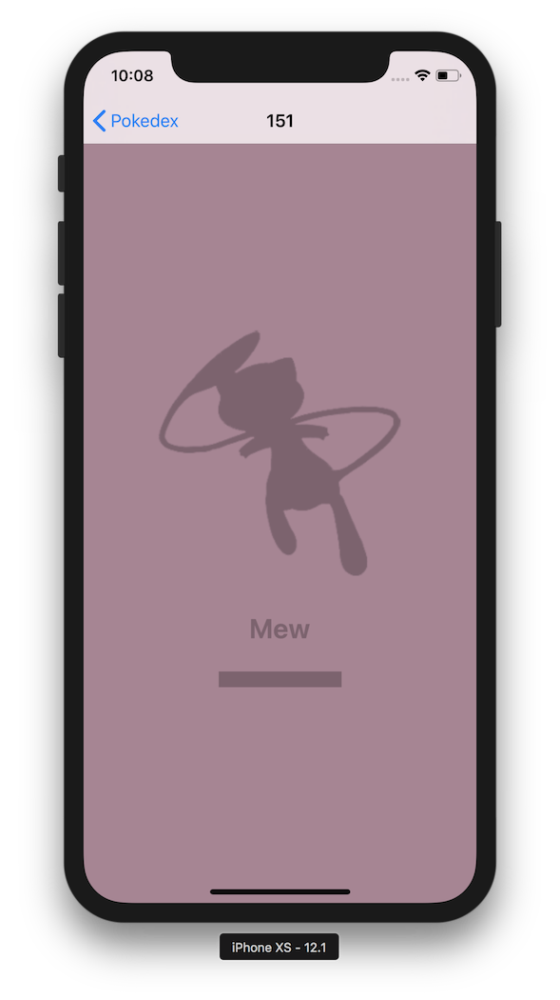
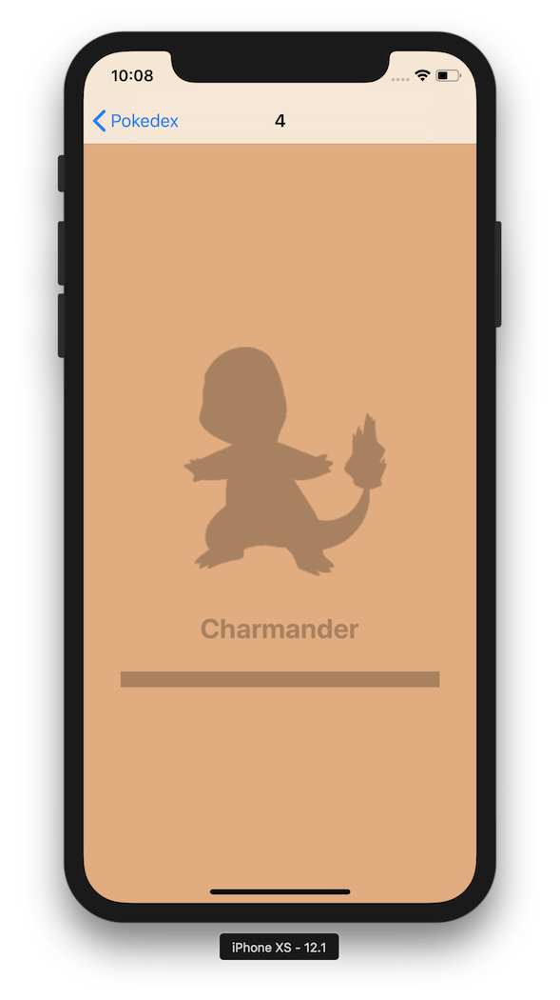

### Workshop #5

# Pokédex

### Opis zadania

Celem zadania jest swtorzenie aplikacji **Pokédex** zawierającej dwa ekrany.

Na pierwszym ekranie mają się znaleźć dwa elementy: `UITextField` oraz `UIButton`. W Text Fieldzie wpisujemy numer Pokémona. Po wciśnięciu przycisku *Search* aplikacja pokazuje kolejny ekran (który jest delikatnie przerobionym ekranem z poprzedniej pracy domowej, który z kolei zajmuje się wyświetleniem szczegółów wyszukanego Pokémona. Na tym ekranie mają się znaleźć 4 elementy: `UILabel`, `UIView`, `UIActivityIndicator` oraz `UIImageView`.

Główną funkcjonalnością aplikacji jest pobieranie Pokémonów z endpointu w API [**Switter**](https://github.com/DaftMobile/switter).

1. Wykorzystaj Endpoint `/api/pokemon/:number/peek`.
2. Użyj sample code z zajęć do pobierania żartów 😉.
3. Pamiętaj o blokowaniu interakcji na czas requestu.
4. Pamiętaj o potencjalnych cyklach referencji oraz wyciekach pamięci (używaj closure capture lists)
5. Aby poprawnie wyświetlić obrazek w kolorze Pokemona, użyj [`renderingMode`](https://developer.apple.com/documentation/uikit/uiimage/1624153-imagewithrenderingmode) w `UIImage` oraz `tintColor` w `UIImageView`.
6. Najważniejsze są poprawne skorzystanie z `URLSession` oraz unikanie blokowania interakcji i wycieków pamięci.

Poniżej screenshoty z gotowej aplikacji:

>Pamiętaj o obsłudze błędów. Co, jeśli użytkownik nie wpisał żadnego tekstu? Co jeśli wpisał litery, a nie liczbę? (Może to zrobić nawet z numeryczną klawiaturą korzystając z klawiatury fizycznej). Co jeśli wpisał indeks Pokémona, który nie istnieje? Zastanów się jak chciałbyś żeby aplikacja się wtedy zachowała gdybyś był jej użytkownikiem, a potem to zaimplementuj.

### Wskazówki

1. Zastanów się nad architekturą aplikacji. Co w niej będzie modelem? Co będzie widokiem? Jak reprezentować Twój *Model* w postaci obiektu / obiektów?
2. Aby przechodzić w łatwy sposób między ekranami użyj `UINavigationController` oraz [`UIStoryboardSegue`](https://developer.apple.com/documentation/uikit/uistoryboardsegue). W internecie jest mnóstwo tutoriali, które w tym pomogą.
3. Będziesz potrzebował dwóch różnych ViewControllerów.
4. W pierwszym ViewControllerze umieść `UITextField` oraz `UIButton`. Użyj AutoLayoutu żeby je ustawić.
5. Aby pokazać odpowiednią klawiaturę (zgodną ze screenshotami), poszukaj opcje `UITextField` w Storyboardzie.
6. Musisz przekazać indeks wybranego Pokémona do drugiego View Controllera. Aby to zrobić, wykorzystaj metodę `prepareForSegue:`.
7. Indeks wybranego Pokemona będzie częścią modelu drugiego ViewControllera – na podstawie indeksu *drugi* View Controller rozpocznie procedurę pobierania Pokemona oraz jego obrazka (są do tego osobne endpointy).
8. Na czas pobierania wyłącz interakcję w widoku oraz pokaż `UIActivityIndicator`
9. **Pamiętaj** o potencjalnych wyciekach pamięci!!
10. Klasy potrzebne do stworzenia odpowiednich struktur Pokémonów oraz koloru pobierz tutaj:
	- [Pokemon.swift](assets/Pokemon.swift)
	- [UIColor+Extension.swift](assets/UIColor+Extension.swift)

### Kryteria oceny

1. Poprawny podział na klasy (zgodnie z MVC i [SRP](https://en.wikipedia.org/wiki/Single_responsibility_principle))
2. Stworzenie odpowiednich constraintów (poprawne wyświetlanie na różnych urządzeniach)
3. Obsługa `UINavigationController` oraz `UIStoyboardSegue`
4. Przekazanie danych pomiędzy ViewControllerami
5. Wybranie odpowiedniej metody na rozpoczęcie pobierania w drugim View Controllerze
6. Poprawne pobieranie danych z internetu
7. Brak wycieków pamięci oraz blokowania głównego wątku
8. Obsługa błędów (celowo nie daję konkretnych wskazówek "co aplikacja powinna wtedy zrobić". Zastanów się nad tym i zaproponuj jakieś rozwiązanie.)

### Odpowiedzi

Odpowiedź (cały, spakowany w .zip folder projektu) wyślij mailem na adres [email](mailto:ios@daftacademy.pl) do końca najbliższej soboty: **15.12.2018, 23:59**.

Przypominam, że jest możliwość wykonania zadania w salce na MiMUW. Termin to **środa w godzinach 16:00 - 18:00**. Przyjdźcie w tym terminie – administratorzy uruchomią Wam system i będziecie mogli wykonać zadanie.
