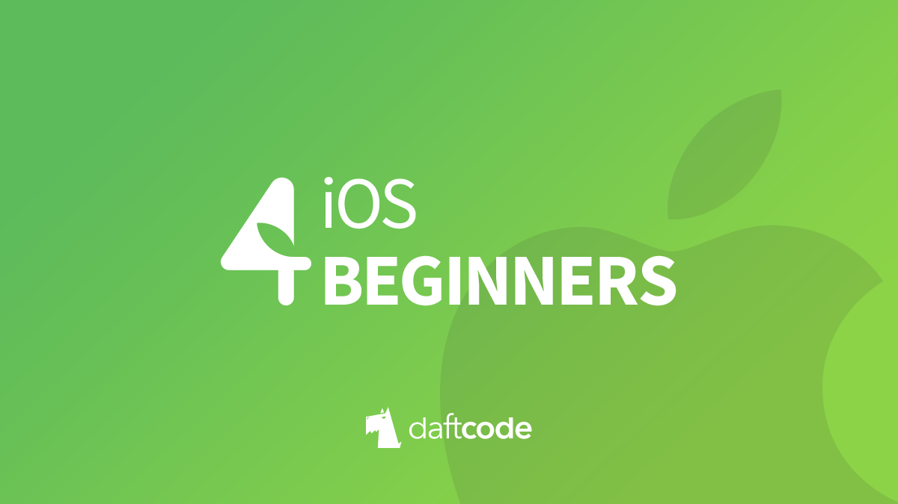

[](https://github.com/DaftMobile/ios4beginners_autumn2018)


[](https://swift.org/)
[](https://ios4beginners-lfv1326.slack.com/)


# iOS 4 Beginners class – MiMUW, Autumn 2018

#### Worshop Results

Workshop results are available [_here_](https://docs.google.com/spreadsheets/d/13SVqW6WuyfQRNcr82uIbwTOoP7PWFx9ceDVNbdZwFgw/edit#gid=0).

Find your data row by hashing your email address using **sha256**. Use an online [tool](http://www.sha1-online.com), or run this bash command:

```sh
printf "email@domain.com" | openssl sha256
```

## Classes

### Class 1: Hello Swift

We were talking about the basics of Swift programming language:

- Variables and **constants** (`var` and `let` keywords)
- `String`
- `Array` and `Dictionary` data types (value types)
- Optionals (`Int?`, `String?`, `if let ...` syntax, and so on)
- Control Flow (`if`, `for` and `while` loops, `switch` statement (💪))
- Functions – defining a function with parameters in Swift (`func` keyword), return value type, calling functions, etc.
- Classes – defining a basic class, defining methods, class properties, initializers. We've also discussed inheritance in Swift, overriding methods and initializers.

To learn more, go through the [Swift Basics](./Class%201) playground.

_Workshop:_

**See the workshop assignment [here](./Class%201/Workshop/workshop1.md).**

### Class 2: Intermediate Swift

We were talking about some more advanced concepts of Swift, including:

- Enums!
- Structs
- Value Types vs Reference Types
- Memory management in Swift

To learn more, go through the [Swift Intermediate](./Class%202) playground.

_Workshop:_

**See the workshop assignment [here](./Class%202/Workshop/workshop2.md).**

### Class 3: iOS Design Patterns

We were talking about Model View Controller application architecture pattern. This approach is strongly recommended by Apple, including all UIKit API designs. You can read more about Apple's interpretation of MVC [here](https://developer.apple.com/library/content/documentation/General/Conceptual/DevPedia-CocoaCore/MVC.html). That's the design pattern that is the easiest to use and understand in small apps (like those we will build during this class).

In summary:

1. Separate your classes into three categories:
	- **Models**: The core of your app's logic. Your database, your business logic, your network requests, etc.
	- **Views**: The most generic and reusable objects here. A `UILabel` and a `UIButton` are views (most of views are subclass of `UIView`) - they don't know anything about what they're displaying or what actions they perform.
	- **Controllers**: Subclasses of `UIViewController`. Their responsibility is to display model data in the views, as well as handle user's actions and represent them to the model
2. Don't let **views** and **models** communicate! Ever! ✋🛑
3. Controllers should own their models.
4. Controllers should own their views.
5. Views communicate with their controllers by [**target-action**](https://developer.apple.com/library/content/documentation/General/Conceptual/Devpedia-CocoaApp/TargetAction.html) mechanism, or by [**delegation**](https://developer.apple.com/library/content/documentation/General/Conceptual/CocoaEncyclopedia/DelegatesandDataSources/DelegatesandDataSources.html) (via `weak` variables and protocols).
6. Models communicate with controllers by notifications (see [`NotificationCenter`](https://developer.apple.com/documentation/foundation/notificationcenter)) (to inform about updates) or by completion [**closures**](https://developer.apple.com/library/content/documentation/Swift/Conceptual/Swift_Programming_Language/Closures.html).

###### Examples:
During this class we've built two sample apps. They both utilize the MVC approach, which works perfectly here. Check out our [Button Counter](./Class%203/ButtonCounter) app.

In case you're wondering if MVC is a real life example: in heavier apps like [RocketLuncher](https://itunes.apple.com/app/id1167572430) we use MVVM-C design pattern. It separates UI actions from model actions and model manipulation, also separating the navigation to a coordinator, which is very useful in bigger apps. On the other hand, we use MVVM in [Skribots](https://itunes.apple.com/app/id1331957263). So it really depends on the app you're working on.

>You can read all about *MVC*, *MVVM* and other iOS Design Patterns in [this great article](https://medium.com/ios-os-x-development/ios-architecture-patterns-ecba4c38de52) by Bohdan Orlov.

_Workshop:_

**See the workshop assignment [here](./Class%203/Workshop/workshop3.md).**


## Resources

- [Install Swift on Linux](https://swift.org/download/#releases) - we're using version `4.2`
- [Open Source Swift](https://swift.org)
- [Free Swift Book](https://itunes.apple.com/us/book/the-swift-programming-language/id881256329?mt=11)
- [iOS Documentation](https://developer.apple.com/documentation/)
- [Apple Development Videos](https://developer.apple.com/videos/)

## Contact

- [Slack](https://ios4beginners-lfv1326.slack.com/)
- [E-mail](mailto:ios@daftacademy.pl)
- [Twitter](https://twitter.com/mdab121)
