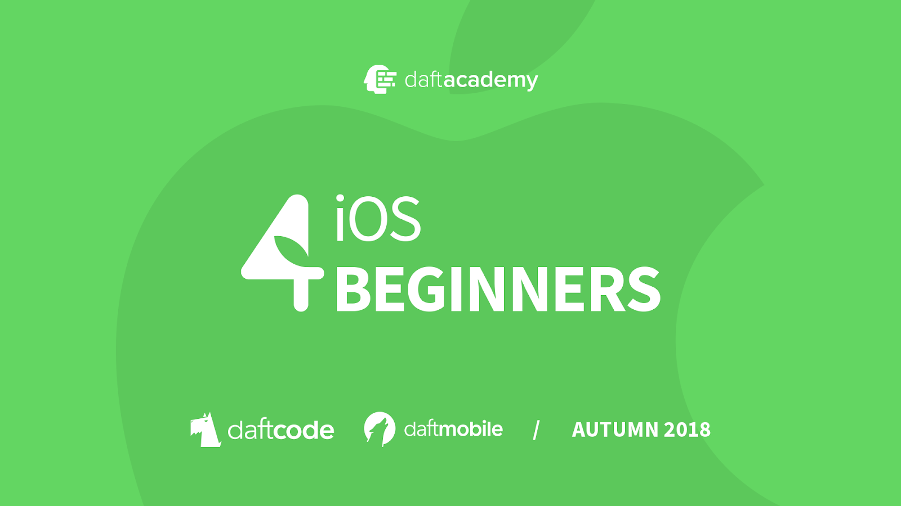

[](https://github.com/DaftMobile/ios4beginners_autumn2018)


[](https://swift.org/)
[](https://ios4beginners-lfv1326.slack.com/)


# iOS 4 Beginners class – MiMUW, Autumn 2018

#### Worshop Results

Workshop results are available [_here_](https://docs.google.com/spreadsheets/d/13SVqW6WuyfQRNcr82uIbwTOoP7PWFx9ceDVNbdZwFgw/edit#gid=0).

Find your data row by hashing your email address using **sha256**. Use an online [tool](http://www.sha1-online.com), or run this bash command:

```sh
printf "email@domain.com" | openssl sha256
```

## Classes

### Class 1: Hello Swift

We were talking about the basics of Swift programming language:

- Variables and **constants** (`var` and `let` keywords)
- `String`
- `Array` and `Dictionary` data types (value types)
- Optionals (`Int?`, `String?`, `if let ...` syntax, and so on)
- Control Flow (`if`, `for` and `while` loops, `switch` statement (💪))
- Functions – defining a function with parameters in Swift (`func` keyword), return value type, calling functions, etc.
- Classes – defining a basic class, defining methods, class properties, initializers. We've also discussed inheritance in Swift, overriding methods and initializers.

To learn more, go through the [Swift Basics](./Class%201) playground.

_Workshop:_

**See the workshop assignment [here](./Class%201/Workshop/workshop1.md).**

## Resources

- [Install Swift on Linux](https://swift.org/download/#releases) - we're using version `4.2`
- [Open Source Swift](https://swift.org)
- [Free Swift Book](https://itunes.apple.com/us/book/the-swift-programming-language/id881256329?mt=11)
- [iOS Documentation](https://developer.apple.com/documentation/)
- [Apple Development Videos](https://developer.apple.com/videos/)

## Contact

- [Slack](https://ios4beginners-lfv1326.slack.com/)
- [E-mail](mailto:ios@daftacademy.pl)
- [Twitter](https://twitter.com/mdab121)
